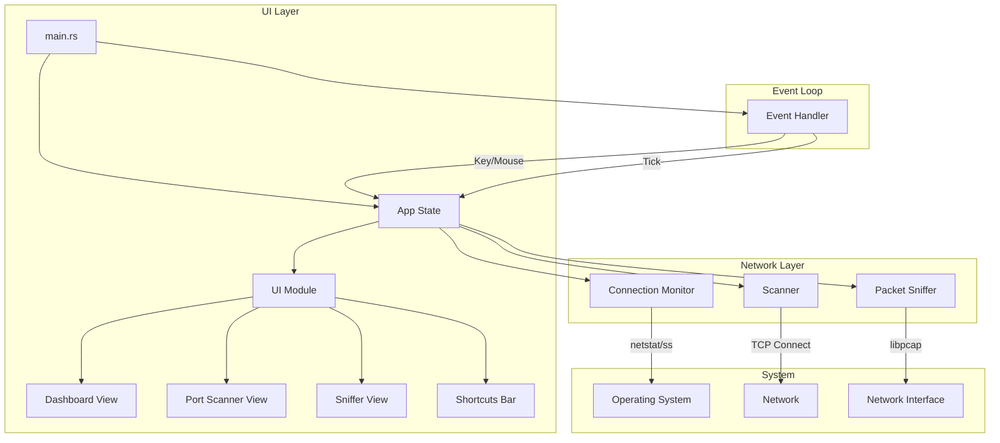
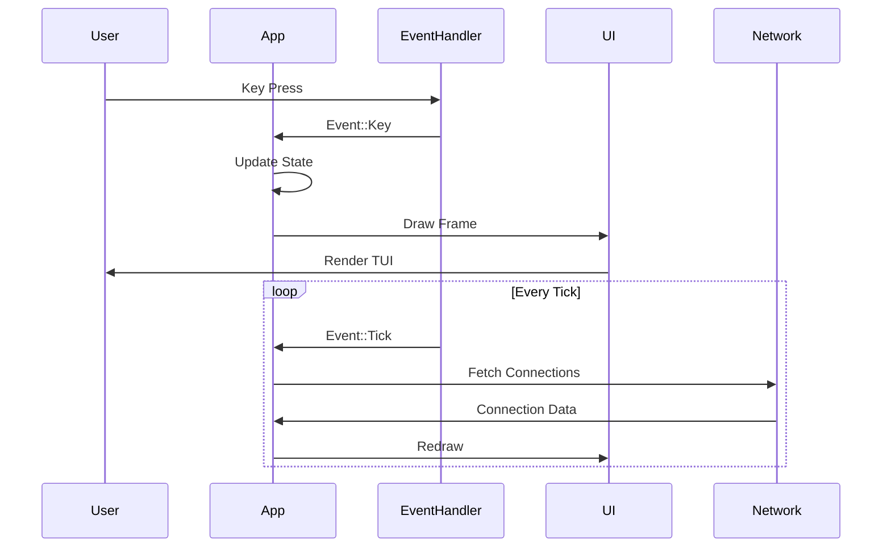

# NetScanner Design Document

## Overview

NetScanner is a Terminal User Interface (TUI) network scanner written in Rust. It provides three main capabilities:
1. **Dashboard** - Real-time monitoring of local network connections
2. **Port Scanner** - Remote host port scanning with service detection
3. **Packet Sniffer** - Live packet capture with protocol analysis

## Architecture



## Data Flow



## Module Structure

```
src/
├── main.rs           # Entry point, terminal setup, main loop
├── app.rs            # Application state and input handling
├── event.rs          # Event handling (keyboard, mouse, tick)
├── ui/
│   ├── mod.rs        # UI coordinator, tab bar
│   ├── theme.rs      # Color theme definitions
│   ├── dashboard.rs  # Dashboard tab rendering
│   ├── scanner.rs    # Port scanner tab rendering
│   ├── sniffer.rs    # Packet sniffer tab rendering
│   └── shortcuts.rs  # Bottom shortcuts bar
├── network/
│   ├── mod.rs        # Network module exports
│   ├── connection.rs # Connection data structures
│   └── monitor.rs    # Background connection monitoring
├── scanner/
│   ├── mod.rs        # Scanner module exports
│   ├── port_scanner.rs    # Port scanning logic
│   └── service_detection.rs # Banner grabbing, service probes
└── capture/
    ├── mod.rs        # Capture module exports
    ├── packet.rs     # Packet data structures
    ├── sniffer.rs    # libpcap wrapper
    └── protocol_hints.rs # Traffic pattern database
```

## Key Components

### App State (`app.rs`)

Central state management for the entire application:
- Current tab and navigation state
- Dashboard panel focus and scroll positions
- Port scanner input, results, and history
- Packet sniffer state, filters, and captured packets
- UI state (shortcuts visibility, status messages)

### Event Handler (`event.rs`)

Async event loop using tokio:
- Keyboard events for navigation and input
- Mouse events (future enhancement)
- Tick events for periodic updates

### Connection Monitor (`network/monitor.rs`)

Background thread that periodically:
- Calls system utilities (netstat on macOS, ss on Linux)
- Parses connection information
- Updates shared state with current connections

### Port Scanner (`scanner/port_scanner.rs`)

Async port scanning with:
- Concurrent TCP connect scans (100 parallel connections)
- Configurable port ranges (Top 100, Top 1000, Full, Custom)
- Banner grabbing for service identification
- Deep probe mode for enhanced detection

### Packet Sniffer (`capture/sniffer.rs`)

libpcap-based packet capture:
- Promiscuous mode capture
- BPF filter support
- Protocol parsing (Ethernet, IP, TCP, UDP)
- Traffic pattern identification

## Technology Stack

| Component | Library | Purpose |
|-----------|---------|---------|
| TUI | ratatui | Terminal rendering |
| Terminal | crossterm | Cross-platform terminal control |
| Async | tokio | Async runtime for concurrent operations |
| Capture | pcap | libpcap bindings for packet capture |
| Parsing | pnet | Network packet parsing |
| Serialization | serde | JSON export |

## Platform Support

- **macOS**: Uses `netstat` for connection monitoring
- **Linux**: Uses `ss` for faster connection monitoring

Both platforms require root/sudo for:
- Packet capture (libpcap)
- Some scan types

## Security Considerations

- Requires elevated privileges for full functionality
- Gracefully handles permission errors
- Protocol hints include security warnings
- BPF filters limit captured traffic
